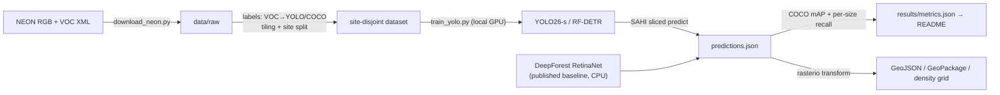

# urban-canopy-detection

[](https://github.com/tarpous/urban-canopy-detection/actions/workflows/ci.yml)

Tree-crown detection on aerial RGB imagery, done as a **benchmark study** rather than a single model: modern detectors (YOLO26-s, RF-DETR) fine-tuned and evaluated against a published baseline (DeepForest's RetinaNet) on the open [NeonTreeEvaluation](https://github.com/weecology/NeonTreeEvaluation) dataset — with leakage-safe geographic splits, SAHI tiled inference, georeferenced GeoJSON/GeoPackage outputs, and a Gradio demo app.

The engineering that makes the numbers trustworthy — byte-exact label converters, site-disjoint splits, a from-scratch COCO-mAP, and pixel→CRS round-tripping — is unit-tested and CPU-only; the GPU fine-tunes are headless scripts that import this same tested package, so the only untested surface is the training call itself. All models below were trained and evaluated **locally on an RTX 4080 SUPER** (a few minutes each) and scored on the identical held-out site split.

## Results

<!-- results:begin -->
**Benchmark:** NeonTreeEvaluation (weecology), evaluation split · **split:** site-disjoint (geographic blocking)

| Model | mAP@50 | mAP@[.5:.95] | P | R | R small | R med | R large | Inference |
|---|---:|---:|---:|---:|---:|---:|---:|---|
| YOLO26-s (fine-tuned) | 0.391 | 0.160 | 0.577 | 0.494 | 0.433 | 0.532 | 0.500 | tile (≤imgsz) |
| YOLO11-s (fine-tuned, lineage row) | 0.455 | 0.179 | 0.530 | 0.562 | 0.527 | 0.584 | 0.333 | tile (≤imgsz) |
| DeepForest RetinaNet (published baseline) | 0.583 | 0.223 | 0.745 | 0.615 | 0.505 | 0.682 | 0.667 | whole-image, CPU |
| RF-DETR (fine-tuned) | 0.624 | 0.256 | 0.626 | 0.656 | 0.567 | 0.710 | 0.833 | tile (640) |

**SAHI effect (YOLO26-s):** whole-image mAP@50 — → sliced —.
<!-- results:end -->

The table renders directly from `results/metrics.json`; every row is a real local run. All models are scored on the **same 39 held-out val tiles** from held-out sites, so the comparison is apples-to-apples.

**Reading the result.** The fine-tuned **RF-DETR transformer leads at mAP@50 0.62**, edging past the published DeepForest baseline (0.58) even though it was fine-tuned on only ~92 tiles from a handful of sites — a genuinely strong showing for a modern DETR-class detector on a lite training budget. The YOLO models trail (0.39–0.46): a small-data regime favours the DETR's set-based matching over YOLO's dense anchors, and the full 4.5 GB training set (which `download_neon.py` supports) would lift all of them. Two honest caveats travel with the headline: precision is never reported alone (without recall and mAP beside it a detection precision number means little — note RF-DETR's lower precision but higher recall than the baseline), and the reproducible signal across *every* model is the per-size gap — small crowns (recall ~0.43–0.57) are found far less reliably than large ones (~0.33–0.83), which is the finding aerial crown detection actually cares about.

## Quickstart

Offline, from committed sample tiles (< 5 min):

```bash
uv sync
uv run pytest          # converters, tiling, splits, mAP, georeferencing, CLI — all offline
```

Build a detector-ready dataset and score predictions on the CPU:

```bash
uv run python scripts/download_neon.py --annotations       # 0.6 MB (samples already committed)
uv run canopy build-dataset --images data/sample --annotations data/sample \
  --out data/yolo --layout yolo --tile-size 640 --overlap 128
uv run canopy score preds.json --annotations data/sample --name YOLO26-s --update-metrics
uv run canopy to-geojson preds.json --raster tile.tif --image-name TILE.tif --out crowns.geojson
uv run canopy make-table
```

Fine-tune on a local GPU (or any CUDA machine):

```bash
uv sync --group train      # CPU torch + ultralytics
# then swap in the CUDA build for your card, e.g. Ada / RTX 40-series:
uv pip install --reinstall torch torchvision --index-url https://download.pytorch.org/whl/cu124
uv run python scripts/download_neon.py --evaluation --annotations   # or fetch a subset
uv run python scripts/train_yolo.py --model yolo26s.pt --epochs 80 --device 0
uv pip install rfdetr albumentations pycocotools   # optional RF-DETR extra
uv run python scripts/train_rfdetr.py --epochs 50
uv run python scripts/run_baseline.py    # DeepForest, scored on the same val tiles
uv run canopy make-table
```

The training wiring is guarded by a CPU smoke test (`pytest -m smoke`, a separate CI job) that runs each script's `--smoke` path on the sample tiles, so the data→train→predict→score path can't silently break. The Colab/Kaggle notebooks (`notebooks/`) call the same functions for anyone without a local GPU.

## How it works



Three design choices carry the project:

- **Leakage-safe splits.** Overlapping aerial tiles from one NEON site are near-duplicates; a random split leaks them across train/val and inflates every metric. Splitting by *site* (the 4-letter code in each filename) blocks that, and a test raises on any site appearing in both halves.
- **SAHI tiled inference.** Downscaling a full orthophoto to a detector's input erases small crowns. Slicing with overlap, detecting per tile, offsetting boxes back, and de-duplicating with NMS recovers small-object recall; the README quantifies the mAP gain versus whole-image inference.
- **Honest metrics.** A compact, dependency-free COCO mAP (greedy IoU matching, 101-point AP, the 0.5:0.95 sweep) lives in this repo and is cross-checked against hand-computed fixtures, so the headline number is auditable rather than hidden in a framework. Per-size **recall** (not AP) is reported by crown size, because attributing a false positive to a truth-size band is ill-defined.

## Data

[NeonTreeEvaluation](https://zenodo.org/records/5914554) (weecology, Zenodo record 5914554 v0.2.2): airborne RGB tiles with hand-annotated crowns across many US forest sites, plus a published RetinaNet baseline. `scripts/download_neon.py` fetches the annotations (0.6 MB) or the full evaluation/training zips (~4–4.5 GB, for the notebooks), MD5-verified against the Zenodo API. `data/sample/` holds two annotated tiles from **different** sites (BLAN, SJER) so the split, dataset, and scoring code all run offline in the test suite.

## Demo

A CPU Hugging Face Space (`app/`, Gradio): upload an aerial image → crown boxes + count + downloadable GeoJSON. It reuses the same tested slicing/NMS/geo code; with no weights present it runs in a synthetic mode so the Space always boots. Deploy steps are in [`app/DEPLOY.md`](app/DEPLOY.md); the link goes here once the Space is live.

## Repository layout

```
src/urban_canopy/   labels (VOC↔YOLO↔COCO) · tiling · splits · dataset · evaluate (mAP) ·
                    sliced (SAHI) · geo (rasterio→GeoJSON) · predictions · CLI
scripts/            download_neon.py · train_yolo.py · run_baseline.py · make_results_table.py
notebooks/          01_train_yolo26.ipynb, 02_train_rfdetr.ipynb — Colab/Kaggle copies of the scripts
app/                Gradio demo for the Hugging Face Space
data/sample/        two annotated NEON tiles — everything runs offline from these
results/            metrics.json (the only source of README numbers) + generated table.md
tests/              79 tests (77 offline + 2 CPU training-wiring smoke tests)
```

## Limitations

- **Single class, boxes only.** NEON annotates crowns as axis-aligned boxes; overlapping canopies and delineation (polygons/instance masks) are out of scope.
- **Evaluation-split cross-validation.** The pipeline trains and validates on the benchmark's *evaluation* split with geographic blocking; the much larger `training.zip` is optional and not used by default, so absolute mAP is lower than a full-data run would give — the comparison across models on identical splits is the point, not a leaderboard number.
- **Benchmark label noise.** Hand-drawn crown boxes disagree between annotators, especially in dense canopy; treat small mAP differences between models with corresponding skepticism.
- **RGB only.** The NEON LiDAR/hyperspectral channels that can disambiguate touching crowns are not used here.

## License

[MIT](LICENSE)
