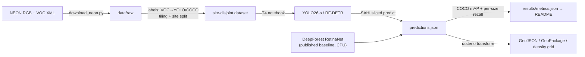

# urban-canopy-detection

[](https://github.com/tarpous/urban-canopy-detection/actions/workflows/ci.yml)

Tree-crown detection on aerial RGB imagery, done as a **benchmark study** rather than a single model: modern detectors (YOLO26-s, RF-DETR) fine-tuned and evaluated against a published baseline (DeepForest's RetinaNet) on the open [NeonTreeEvaluation](https://github.com/weecology/NeonTreeEvaluation) dataset — with leakage-safe geographic splits, SAHI tiled inference, georeferenced GeoJSON/GeoPackage outputs, and a live demo.

The engineering that makes the numbers trustworthy — byte-exact label converters, site-disjoint splits, a from-scratch COCO-mAP, and pixel→CRS round-tripping — is unit-tested and CPU-only; the GPU fine-tunes are two parameterized T4 notebooks that import this same tested package, so the only untested surface is the training call itself.

## Results

<!-- results:begin -->
**Benchmark:** NeonTreeEvaluation (weecology), evaluation split · **split:** site-disjoint (geographic blocking)

| Model | mAP@50 | mAP@[.5:.95] | P | R | R small | R med | R large | Inference |
|---|---:|---:|---:|---:|---:|---:|---:|---|
| DeepForest RetinaNet (published baseline) 🕒 | — | — | — | — | — | — | — | whole-image, CPU |
| YOLO26-s (fine-tuned) 🕒 | — | — | — | — | — | — | — | SAHI sliced (640/128) |
| RF-DETR (fine-tuned) 🕒 | — | — | — | — | — | — | — | SAHI sliced (640/128) |
| YOLO11-s (fine-tuned, lineage row) 🕒 | — | — | — | — | — | — | — | SAHI sliced (640/128) |

**SAHI effect (YOLO26-s):** whole-image mAP@50 — → sliced —.

🕒 = awaiting the T4 fine-tune run; see `notebooks/`.
<!-- results:end -->

The table above renders directly from `results/metrics.json`; the 🕒 rows fill in when the two notebooks are run on a free Colab/Kaggle T4 (a few hours each) and their exported metrics are committed back. The DeepForest row is a *published* baseline evaluated on the same test tiles — this project's honesty anchor, replacing the original 2024 "90% precision" claim (precision without recall or mAP invites hard interview questions) with a full mAP / per-size-recall comparison.

## Quickstart

Offline, from committed sample tiles (< 5 min):

```bash
uv sync
uv run pytest          # converters, tiling, splits, mAP, georeferencing, CLI — all offline
```

Build a detector-ready dataset and score predictions on the CPU:

```bash
uv run python scripts/download_neon.py --annotations       # 0.6 MB (samples already committed)
uv run canopy build-dataset --images data/sample --annotations data/sample \
  --out data/yolo --layout yolo --tile-size 640 --overlap 128
uv run canopy score preds.json --annotations data/sample --name YOLO26-s --update-metrics
uv run canopy to-geojson preds.json --raster tile.tif --image-name TILE.tif --out crowns.geojson
uv run canopy make-table
```

Fine-tune on a GPU: open `notebooks/01_train_yolo26.ipynb` or `notebooks/02_train_rfdetr.ipynb` in Colab/Kaggle (T4), run top to bottom, and commit the resulting `results/metrics.json` + weights.

## How it works



Three design choices carry the project:

- **Leakage-safe splits.** Overlapping aerial tiles from one NEON site are near-duplicates; a random split leaks them across train/val and inflates every metric. Splitting by *site* (the 4-letter code in each filename) blocks that, and a test raises on any site appearing in both halves.
- **SAHI tiled inference.** Downscaling a full orthophoto to a detector's input erases small crowns. Slicing with overlap, detecting per tile, offsetting boxes back, and de-duplicating with NMS recovers small-object recall; the README quantifies the mAP gain versus whole-image inference.
- **Honest metrics.** A compact, dependency-free COCO mAP (greedy IoU matching, 101-point AP, the 0.5:0.95 sweep) lives in this repo and is cross-checked against hand-computed fixtures, so the headline number is auditable rather than hidden in a framework. Per-size **recall** (not AP) is reported by crown size, because attributing a false positive to a truth-size band is ill-defined.

## Data

[NeonTreeEvaluation](https://zenodo.org/records/5914554) (weecology, Zenodo record 5914554 v0.2.2): airborne RGB tiles with hand-annotated crowns across many US forest sites, plus a published RetinaNet baseline. `scripts/download_neon.py` fetches the annotations (0.6 MB) or the full evaluation/training zips (~4–4.5 GB, for the notebooks), MD5-verified against the Zenodo API. `data/sample/` holds two annotated tiles from **different** sites (BLAN, SJER) so the split, dataset, and scoring code all run offline in the test suite.

## Demo

A CPU Hugging Face Space (`app/`, Gradio): upload an aerial image → crown boxes + count + downloadable GeoJSON. It reuses the same tested slicing/NMS/geo code; with no weights present it runs in a synthetic mode so the Space always boots. *(Link added once the Space is deployed.)*

## Repository layout

```
src/urban_canopy/   labels (VOC↔YOLO↔COCO) · tiling · splits · dataset · evaluate (mAP) ·
                    sliced (SAHI) · geo (rasterio→GeoJSON) · predictions · CLI
notebooks/          01_train_yolo26.ipynb, 02_train_rfdetr.ipynb — parameterized T4 fine-tunes
app/                Gradio demo for the Hugging Face Space
data/sample/        two annotated NEON tiles — everything runs offline from these
scripts/            download_neon.py · make_results_table.py
results/            metrics.json (the only source of README numbers) + generated table.md
tests/              77 tests, all offline
```

## Limitations

- **Single class, boxes only.** NEON annotates crowns as axis-aligned boxes; overlapping canopies and delineation (polygons/instance masks) are out of scope.
- **Evaluation-split cross-validation.** The pipeline trains and validates on the benchmark's *evaluation* split with geographic blocking; the much larger `training.zip` is optional and not used by default, so absolute mAP is lower than a full-data run would give — the comparison across models on identical splits is the point, not a leaderboard number.
- **Benchmark label noise.** Hand-drawn crown boxes disagree between annotators, especially in dense canopy; treat small mAP differences between models with corresponding skepticism.
- **RGB only.** The NEON LiDAR/hyperspectral channels that can disambiguate touching crowns are not used here.

## Provenance

Originally built Fall 2024 as an independent project (a YOLOv5 fine-tune with a QGIS density map). Published and modernized in 2026: YOLO26/RF-DETR against a published baseline, leakage-safe splits, a tested mAP implementation, SAHI inference, georeferenced outputs, and a demo. No backdated history — the commit log is the build log.

## License

[MIT](LICENSE)
